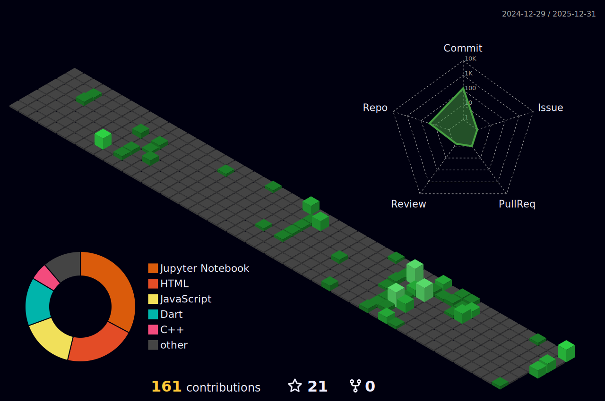
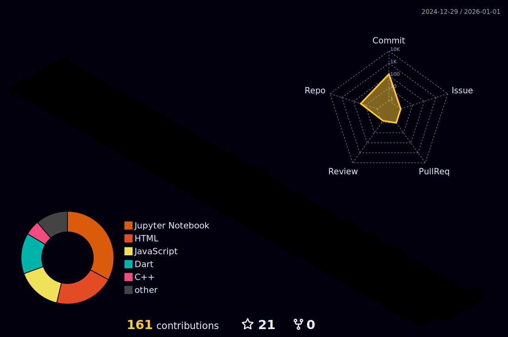
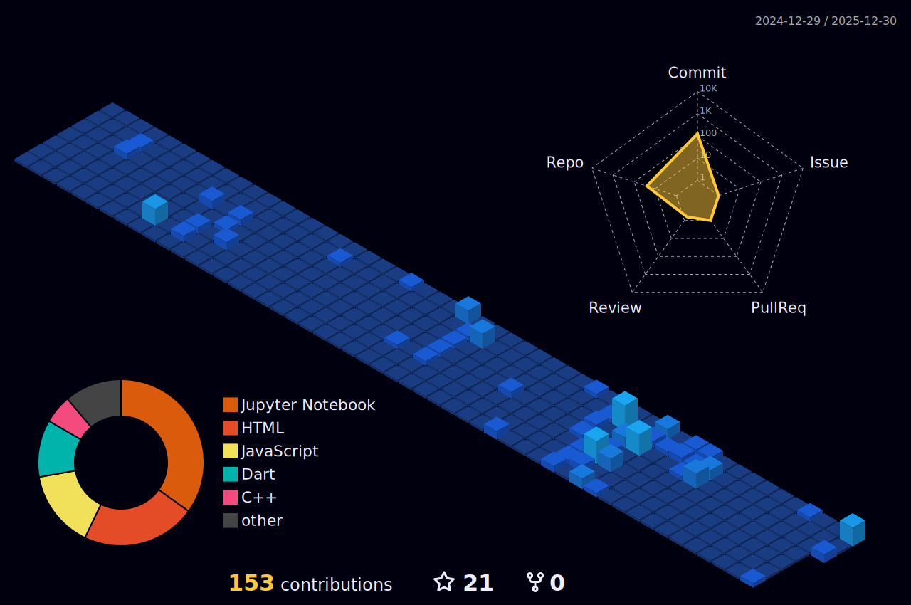
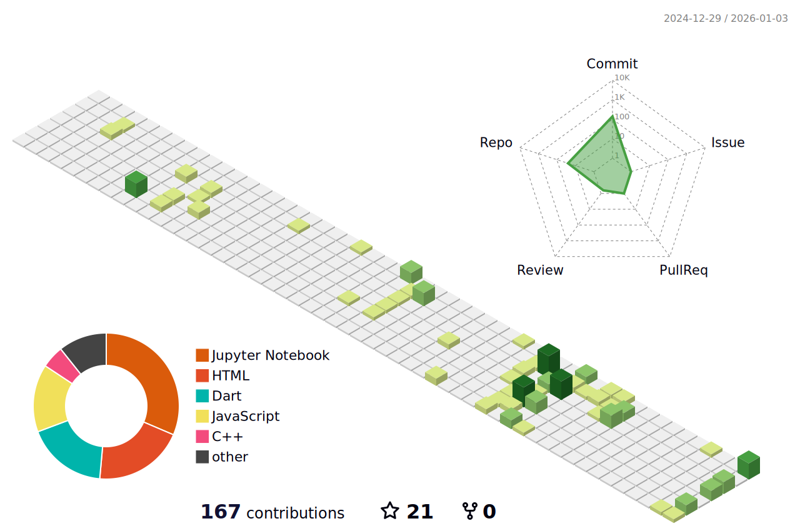
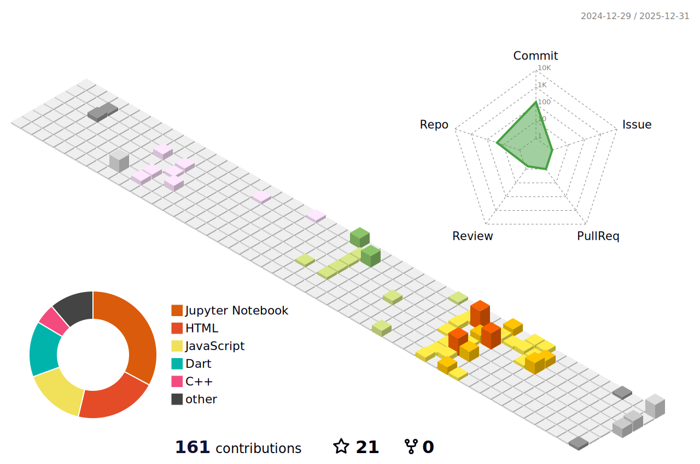
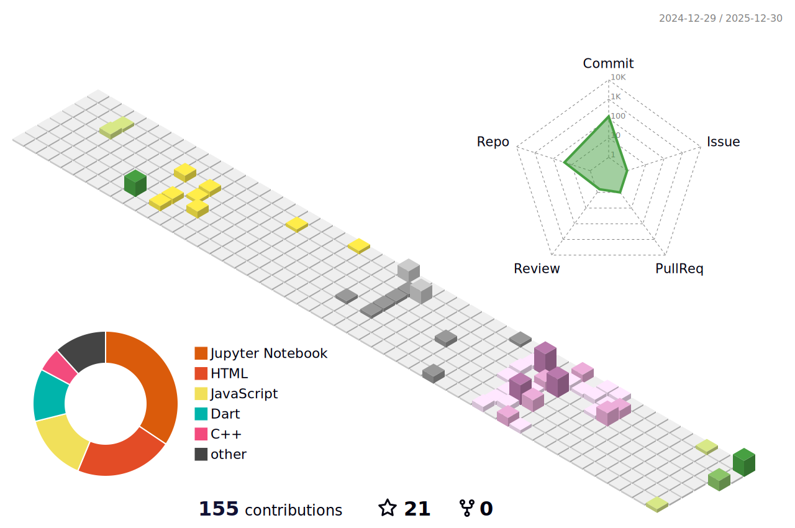
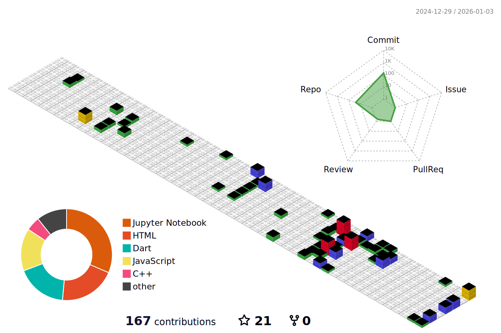

<!-- ===================== -->
<!--       HEADER         -->
<!-- ===================== -->

  

---

# 👋 Halo, Saya **Rifa Amril Sahputra**

💻 **Fullstack Developer & AI Enthusiast**  
🚀 Fokus pada pengembangan **Web, Mobile Applications, dan Artificial Intelligence**  
🎯 Passion: *Membangun solusi digital modern, scalable, dan berdampak nyata*  
✨ Motto: *Code the Future, Create with Passion, Inspire the World.*

---

## 🧠 Tentang Saya

- 🌐 Mengembangkan **Web Application** menggunakan **React & Next.js**
- 📱 Membangun **Mobile Application** modern dengan **Flutter**
- 🤖 Mendalami **Artificial Intelligence**  
  *(Machine Learning, Computer Vision, Natural Language Processing)*
- 🎓 Aktif dalam **penelitian, eksplorasi teknologi, dan kolaborasi tim**
- 🎨 Mengutamakan **UI/UX clean**, performa tinggi, dan maintainable code

---

## 🚀 Tech Stack

  
  
  
  
  
  
  
  
  

---

## 📊 GitHub Contribution 3D

  

<!-- ===============================
     Alternative 3D Contribution Styles
     (Uncomment to use)
================================ -->

<!-- 🌈 Night Rainbow -->
<!--

  

-->

<!-- 🌙 Night View -->
<!--

  

-->

<!-- 🍃 Green Animate -->
<!--

  

-->

<!-- 🌸 Season (Northern Hemisphere) -->
<!--

  

-->

<!-- 🌎 Season (Southern Hemisphere) -->
<!--

  

-->

<!-- 🧱 Git Block -->
<!--

  

-->

## 🌟 Quote Inspiratif

  <em>
    "Artificial Intelligence tidak akan menggantikan manusia,  
    tetapi manusia yang menguasai AI akan menggantikan yang tidak." 🚀
  </em>

---

## 🌐 Temukan Saya di

  
  
  

---

<!-- ===================== -->
<!--        FOOTER        -->
<!-- ===================== -->

